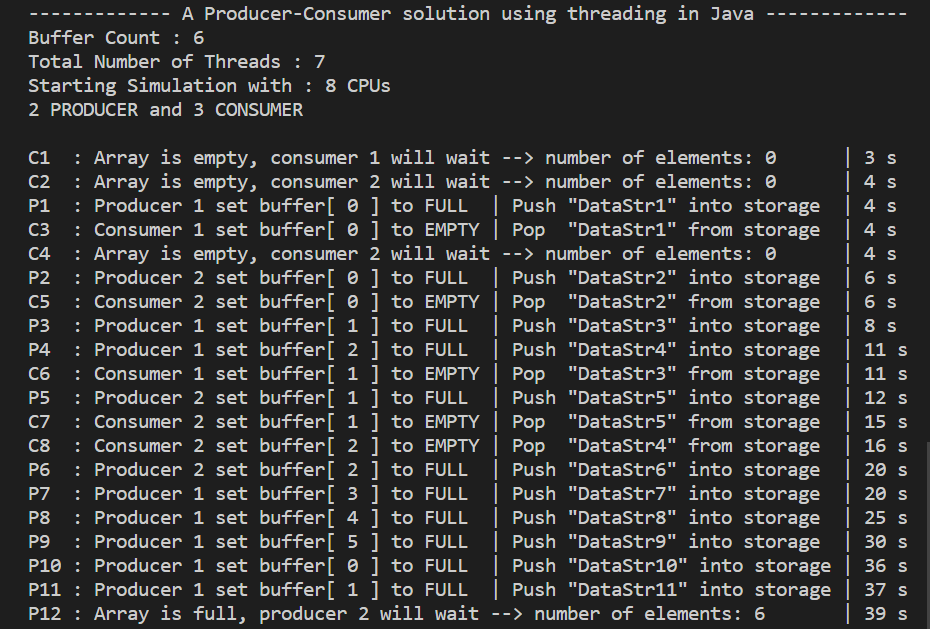
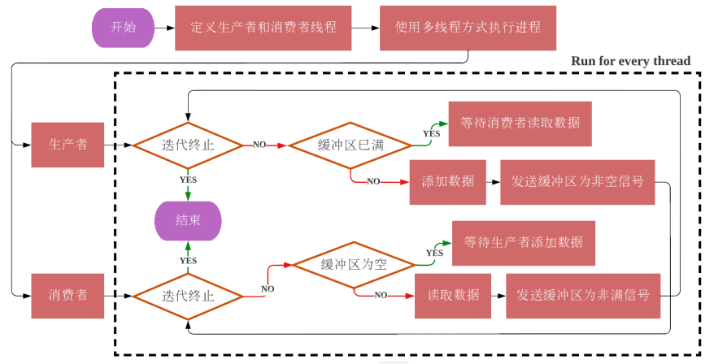

# Producer-Consumer-Buffer
 Buffer pool with 6 buffers containing 2 producers and 3 consumers

### **About**

The producer-consumer based buffer mode involves two processes, the producer process and the consumer process that share a fixed-size buffer. The role of the producer is to put one set of data into the buffer at a time, and the role of the consumer is to read one set of data from the buffer at a time. One of the goals of the buffer is to ensure that producers do not add data to a full buffer, and consumers do not read data from an empty buffer. 

**The characteristics required in the buffer are as follows:** 

1. A request to put an item into the buffer is issued at a random time; 
2. After a consumer reads one set of data from the buffer, it will immediately prepare to read another set data; 
3. Define a buffer with a fixed size; 
4. If the buffer is full, wait for the consumer to take the data before adding it; 
5. If the buffer is empty, wait for the producer to add data before reading.

### **Problem**

In computer science, the producer and consumer problem is a classic example of a multi-process synchronization problem. Synchronization is an important and familiar problem in software design and development, many applications use synchronization as their method and solution. 

The buffer is suitable for multi-processor environment. The module adopts multi-thread parallel processing technology, making N producers and the consumers can perform tasks simultaneously, ensuring that the resources shared are fully optimized. 

A deadlock occurs if the consumer successfully acquires the semaphore while the buffer is empty. If there is no consistency or synchronization between the producer and the consumer such that both access the critical section at the same time, a deadlock can occur and both the consumer and the producer will enter a wait state, resulting in a deadlock.

### **Solution**

The Java programming language uses the keyword synchronized as the prefix of the method to achieve synchronization, allowing only one thread to enter the synchronization code at the same time, avoiding the abuse of key resources. Java can also control the communication between threads through methods such as wait(), notify() or notifyAll(). 

The method wait keeps the thread waiting until the method notify notifies it to end the waiting, so the experiment uses the synchronized modified producer class Producer and consumer class Consumer to lock the producer and consumer. When a thread enters the synchronized method of an object, other threads cannot enter the method, but if wait() method is called in the synchronized method, other threads can enter the method.

### **Output Result**

### **Algorithm Flowchart**

### **Analysis**

This experiment uses multiple buffers between producers and consumers as critical sections. Producers can keep putting products into the buffer until the buffer is full, and consumers can keep getting products from the buffer until the buffer is empty. Unlike single buffer, this approach requires more communication between producer and consumer. The producer's solution to a full buffer is to go to sleep, and the next time the consumer removes data from the buffer, the producer will wake up and start adding data to the buffer again. Similarly, if the consumer judges that the buffer is empty, it will enter the sleep state, and the next time the producer adds data to the buffer, it will wake up the consumer in the sleep state.
